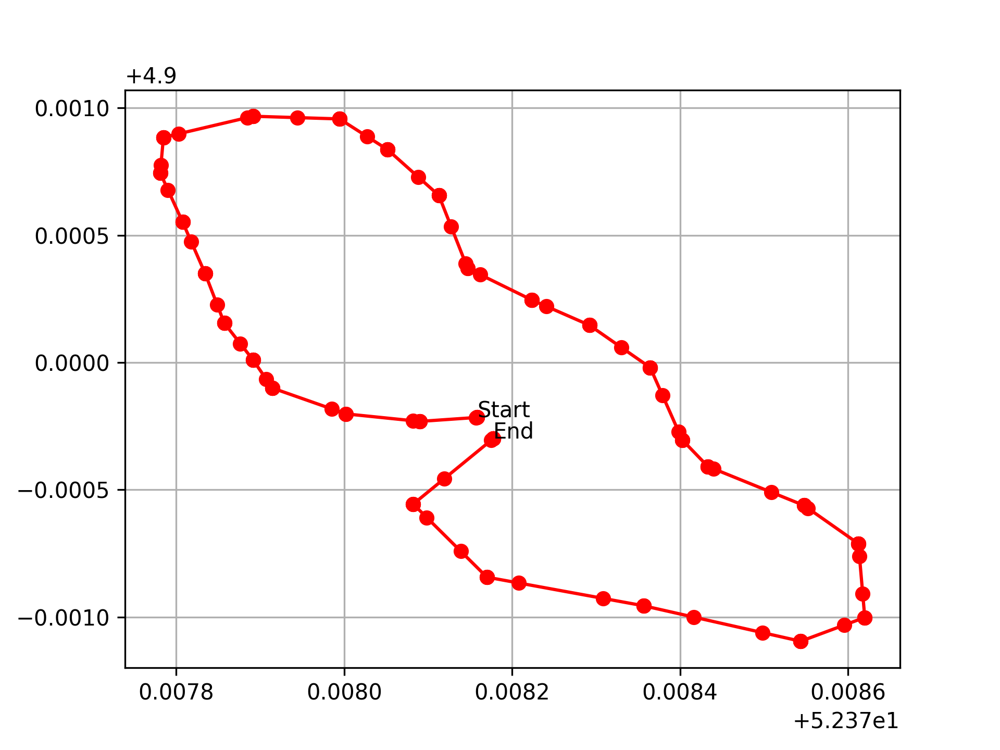
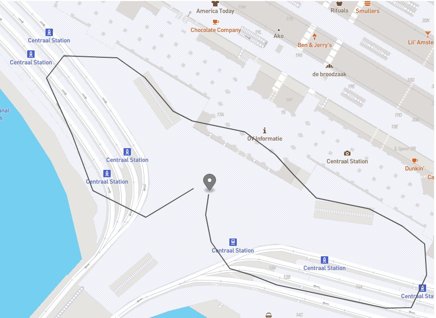

# _{GRPC Drone commander}_

#### _{Server and client for sending drones on a route}_

#### By _**{snoeprol}**_

## Technologies Used

* _Asyncio_
* _GRPC_

## Description

_{This application runs a server and a client that reports the position. Can be used with multiple drones.}_

## Example path

## Contact Information

_{snoeprol.github.io/}_
